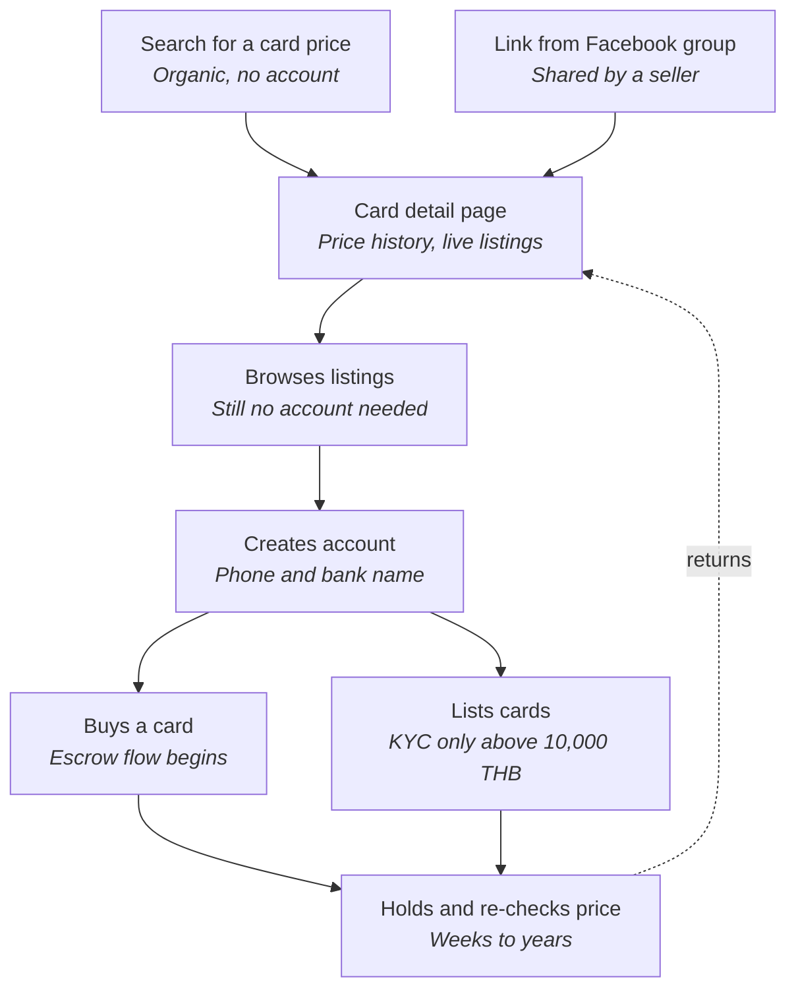
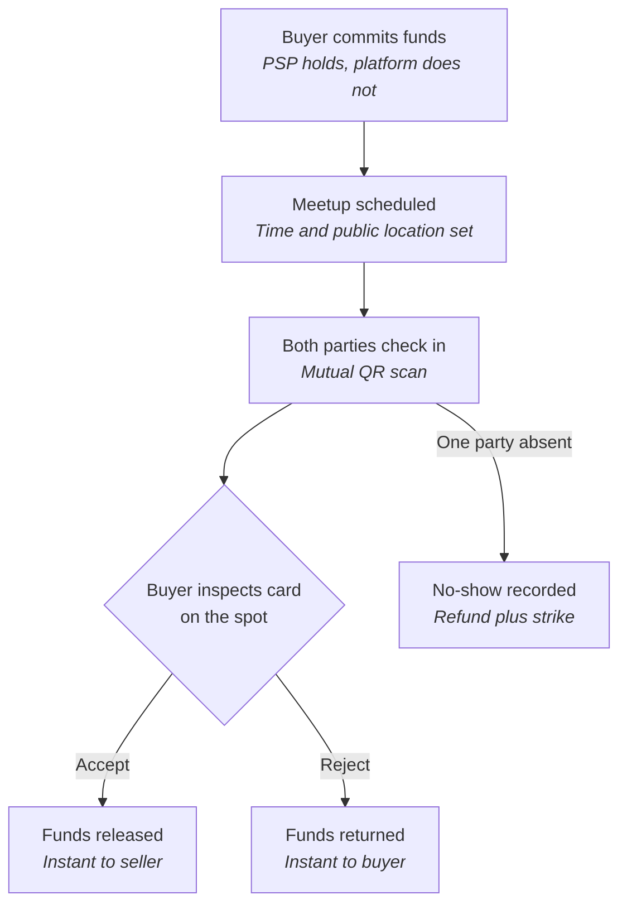
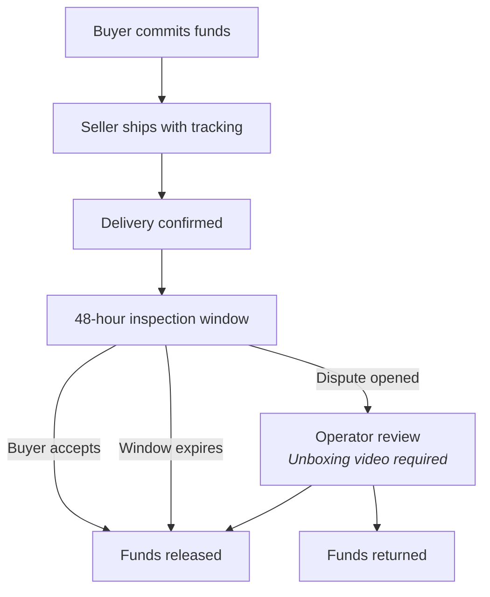

# 03 — User Journeys and Service Blueprint

**Status:** Draft for cofounder review
**Last updated:** 16 August 2026

Diagrams are Mermaid and render in GitHub, GitLab, Notion and most markdown viewers.

---

## 1. Full user lifecycle

From first contact to long-term retention.

**Two things this makes visible.**

**The account wall sits four steps in, and that is the strategy.** Discovery, landing and browsing all happen logged out. Gating browse behind signup kills both SEO and conversion — and organic search is the only free acquisition channel, since a card price query is exactly what a Thai collector types into Google.

**The return loop is the business.** A collector holding for two years transacts almost never but price-checks constantly. That loop is what makes them a user rather than a one-time visitor. Currently the only thing pulling them back is the price page, which is precisely the gap the portfolio tracker fills.

**Not drawn: churn.** Every transition leaks — bounced from search, browsed and left, abandoned signup, listed once and never returned. Each needs a drop-off expectation and a metric.

---

## 2. Face-to-face settlement flow

The primary transaction path, and where the product's real complexity sits.

### Open design decisions in this flow

Three gaps the PRD leaves soft. Each changes what sits behind the curtain, so they should be settled before build.

**Rejection is currently free for the buyer.** As drawn, a buyer can commit, meet, reject on a whim and walk away at no cost while the seller has burned a trip across Bangkok. Options: require a reason code, surface a rejection-rate stat on the profile, or throttle repeat rejectors.

**No-show has no adjudication.** Whoever scans first can claim the other did not appear. Options: mutual-scan-or-nothing (simple, but a flat tyre becomes a strike), or an operator review path.

**There is no expiry.** Funds sit committed indefinitely if the parties never schedule. Needs an auto-cancel; 72 hours is a reasonable starting point for a same-day market.

---

## 3. Shipped settlement flow

---

## 4. Service blueprint

Three lanes: **Frontstage** (what the user sees), **Backstage** (what the system does), **Support** (people and third parties that must exist).

### 4.1 Discovery and onboarding

| Stage | Frontstage | Backstage | Support |
|---|---|---|---|
| Arrival | Lands on card page — from search or shared link | Serves catalog page; price index query | Catalog data ops; corrections queue |
| Browse | Browses listings; filters by condition | Ranks live listings; filter and sort | Seeded price data; Facebook archaeology |
| Signup | Creates account; phone and bank name | Bank name check against phone identity | PSP identity service verifies account name |

The support lane here is almost entirely catalog work. That is the honest picture of where the first eight weeks go.

### 4.2 Seller listing

| Stage | Frontstage | Backstage | Support |
|---|---|---|---|
| Select | Selects the card; search by set | Links to catalog card; variant and language | Catalog gaps queue; operator adds missing cards |
| Evidence | Guided photo capture; six required shots | Photo protocol check; blocks incomplete sets | Condition standard; NM to DMG definitions and examples |
| Publish | Sets price; sees sold history | KYC gate at 10,000฿; prompts upgrade | PSP merchant KYC; ID and bank checks |

**The catalog gaps queue is underestimated.** A seller who cannot find their card abandons the listing, so this queue needs same-day turnaround or supply leaks.

### 4.3 Settlement and retention

| Stage | Frontstage | Backstage | Support |
|---|---|---|---|
| Commit | Commits to escrow; meetup scheduled | Authorized via PSP; no platform custody | Meetup venue list; public safe points |
| Settle | Inspects and accepts, or rejects on the spot | Captures or voids; triggered by check-in | Dispute queue; operator adjudicates |
| Return | Re-checks prices; weeks to years later | Adds to price index; settled trades only | Manipulation watch; flags fake sales |

---

## 5. What the blueprint reveals

**The platform is four operational queues in a trench coat.** Catalog corrections, catalog gaps, disputes, and manipulation review. None are features; all are people; all scale with volume rather than with code.

Two consequences:

- **The headcount plan is really a queue-automation plan.** Each queue is a cost line growing with GMV unless designed down.
- **Only one is optional at launch.** Manipulation watch can wait until the price index has enough authority to be worth gaming.

**The payment provider appears in the support lane of every diagram.** Identity, merchant KYC and settlement all run through one vendor — a single point of failure across the entire product. This raises the stakes on vendor selection well above API quality.

---

## 6. Next diagrams not yet built

- Dispute resolution flow with evidence states and operator decision tree — highest value remaining, since it governs the queue most likely to consume operator hours
- Bulk listing flow for a seller with 40 cards
- Churn-annotated lifecycle with expected drop-off and the metric measuring each transition
- Auction flow (phase 2)
